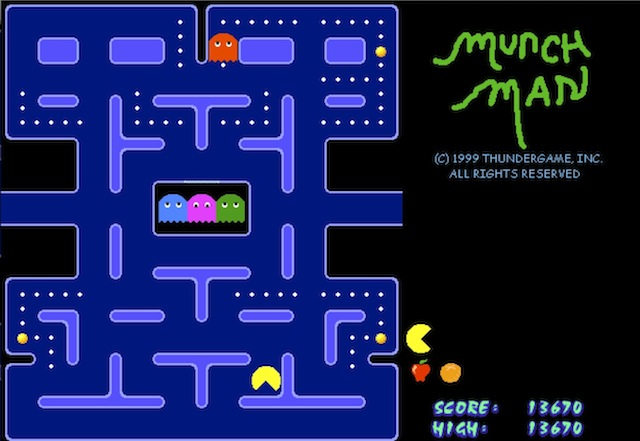

MunchMan
===========

This is my version of the classic video game Pac-Man, as an Enclipse Java project.

Use the arrow keys to move.

As in the original game, the ghosts move at slightly different speeds, and have different
'personalities': i.e., aggressiveness, intelligence.  This game is actually closer to 
the original's sequel, Ms Pac-Man, since there are a number of different mazes and the
fruit bounce across the screen.

Loading the page "Applet.html" within a browser should (maybe) start the program.
Failing that, from a command line you can try "appletviewer Applet.html".
The applet can also be found at [this page](http://www.cs.ubc.ca/~jpsember/sfu/munchman.html).

